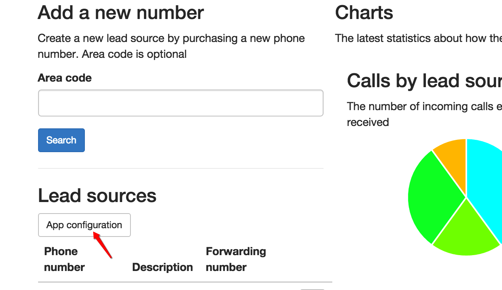

# Call tracking with Twilio, Node.js, and Express

[](https://travis-ci.org/TwilioDevEd/call-tracking-node)

This application demostrates how to use Twilio track calls and measure
the effectiveness of marketing campaigns.  A tutorial walkthrough exists [here](https://www.twilio.com/docs/tutorials/walkthrough/call-tracking/node/express) to help with setting this up.

## Running the Project on Your Machine

To run this project on your computer, download or clone the source. You will 
also need to download and install either [Node.js](http://nodejs.org/) 
or [io.js](https://iojs.org/en/index.html), both of which should also install 
[npm](https://www.npmjs.com/). 

You will also need to [sign up for a Twilio account](https://www.twilio.com/try-twilio) 
if you don't have one already.

### Install Dependencies

Navigate to the project directory in your terminal and run:

```bash
npm install
```

This should install all of our project dependencies from npm into a local 
`node_modules` folder.

### Create a TwiML App

This project is configured to use a **TwiML App**, which allows us to easily set the voice URLs for all Twilio phone numbers we purchase in this app.

Create a new TwiML app at https://www.twilio.com/user/account/apps/add and use its `Sid` as the `TWIML_APP_SID` environment variable wherever you run this app.    


See the end of the "Exposing Webhooks to Twilio" section for details on the exact URL to use in your TwiML app.

### Configuration

This application is configured using [dotenv](https://www.npmjs.com/package/dotenv). Begin by copying the example .env file to use in this application:

```bash
cp .env.example .env
```

Next, open the `.env` at the root of the project and update it with credentials
from your [Twilio account](https://www.twilio.com/user/account/voice-messaging)
and local configuration. You will also need to set `MONGO_URL`, which is how we
will connect to our database.

This sample application stores data in a MongoDB database using 
[Mongoose](http://mongoosejs.com/). You can download and run MongoDB 
yourself ([OS X](http://docs.mongodb.org/manual/tutorial/install-mongodb-on-os-x/), 
[Linux](http://docs.mongodb.org/manual/tutorial/install-mongodb-on-ubuntu/), 
[Windows](http://docs.mongodb.org/manual/tutorial/install-mongodb-on-windows/)), 
or you can use a hosted service like
[compose.io](https://www.compose.io/).

On OS X, the maybe the easiest way to get MongoDB running locally is to install
via [Homebrew](http://brew.sh/).

```bash
brew install mongodb
```

You should then be able to run a local server with:

```bash
mongod
```

By default, there will be a local database running that's not password protected. In your `.env` file, set `MONGO_URL` to `mongodb://127.0.0.1/calltracking`.

Then, you'll need a `SEGMENT_WRITE_KEY`. This is the key that lets [Segment](https://segment.com/) ([sign up for free](https://segment.com/signup)), a customer data platform, know which project to collect analytics data from. You can find your `SEGMENT_WRITE_KEY` by following [this help article](https://help.segment.com/hc/en-us/articles/208330506-Where-do-I-find-my-writeKey-).

You should now be all set to run the app locally!

### Running the Project

To launch the application, you can use `node .` in the project's root directory. 
You might also consider using [nodemon](https://github.com/remy/nodemon) for 
this. It works just like the node command, but automatically restarts your 
application when you change any source code files.

```bash
npm install -g nodemon
nodemon .
```

### Running Tests

Basic functional tests (requires local MongoDB) can be run with:

```bash
npm test
```

### Exposing Webhooks to Twilio

To test your application locally with a Twilio number, we recommend using 
[ngrok](https://ngrok.com/docs). Use ngrok to expose a local port and get a 
publicly accessible URL you can use to accept incoming calls or texts to your 
Twilio numbers.

The following example would expose your local Node application running on port 
3000 at `http://chunky-danger-monkey.ngrok.io` (note that *reserved* subdomains 
are a paid feature of ngrok):

```bash
ngrok http -subdomain=chunky-danger-monkey 3000
```

In your Twilio app configuration you'll need to set
`http://<your-ngrok-domain>.ngrok.io/lead` as the callback URL. Open
the application and then click the "App configuration" button.



The button will take you to your TwiML call tracking
application. Under "Voice" you will find a "Request URL" input
box. There you should put the URL to the application's lead resource
(e.g `http://<your-ngrok-domain>.ngrok.io/lead`).


## License

MIT